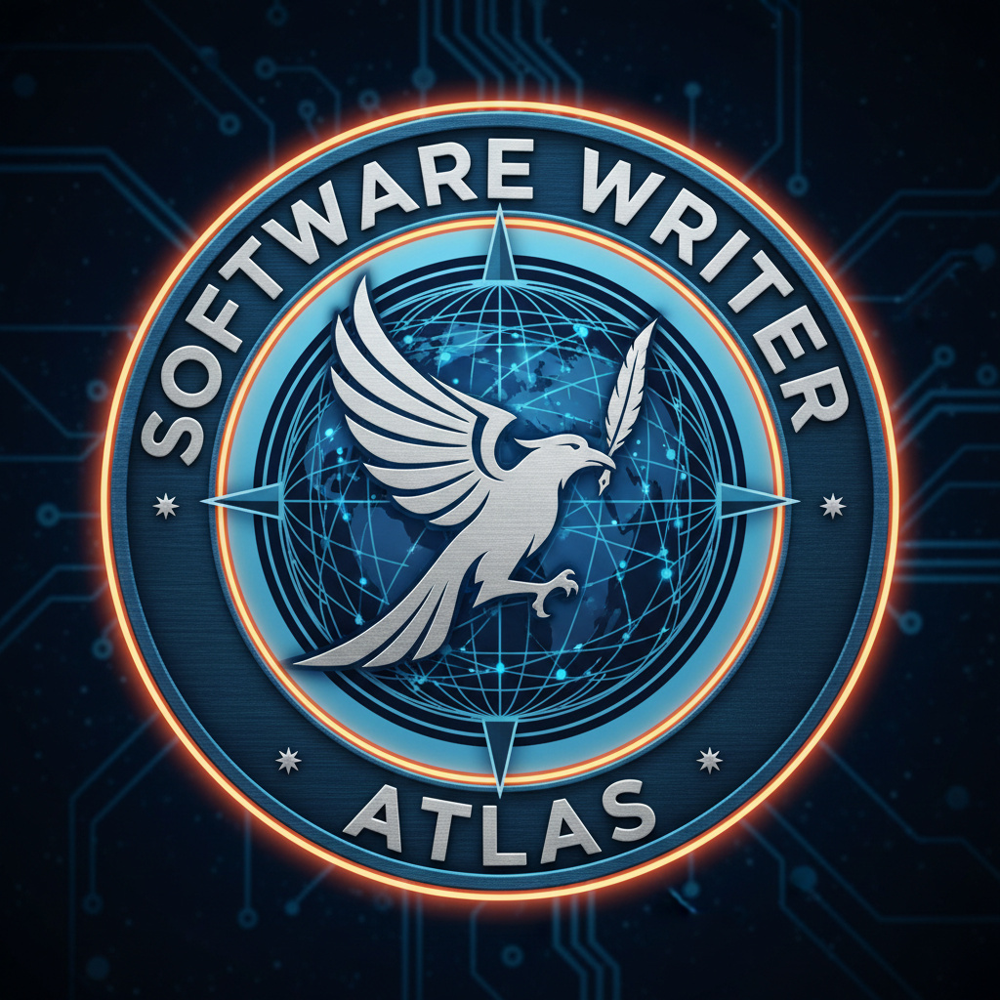

#  sw-atlas

One semantic index over everything Software Wrighter publishes, and a tiny
model that turns a visitor's sentence into a typed decision about it.

<br clear="left"/>

The index holds the facts. The model holds only the language. Every site --
the [campus](https://github.com/software-wrighter-lab/sw-campus), the
[blog](https://blog.softwarewrighter.com/), a live demo -- mounts the same
engine and gives it a different name and face.

```
                    sw-atlas
                       |
        +--------------+--------------+
        |              |              |
      engine         corpus         model
        |
   +----+-----+-----------+-----------+----------+
   |          |           |           |          |
 Docent     Guide     Librarian     Tutor    Archivist
 museum     campus       blog     live demo    repos
```

## Summary

A visitor asks "where was that thing about running experts from disk?".
Answering it well normally costs a large model, a server and a second or
two. Atlas moves almost all of that work to the night before.

```
        NIGHTLY -- expensive, once, on our hardware
   ------------------------------------------------
   blog / campus / repos / videos
              |
              v
     ingest, relate, synthesize questions,
     embed, train, calibrate, regression-test
              |
              v
        published snapshot  (a few MB)

        BROWSER -- cheap, every time, on theirs
   ------------------------------------------------
   question -> typed decision -> catalog lookup -> answer
```

The model never writes prose, a URL, or a resource id. It emits an intent,
a set of concepts, a set of resource kinds and a confidence; ordinary
deterministic code resolves those against the published catalog. A stale
model therefore cannot invent an exhibit or a dead link -- the worst it can
do is route badly, and say so with a low number.

Everything runs in the visitor's browser, and it starts small: a
deterministic matcher in under 10 MiB that works everywhere, promoted one
class at a time up to a routed model at 128 MiB only when the machine can
comfortably afford it, and demoted the moment it cannot.

| Class | RAM target | Capability |
|---|---:|---|
| A0 Minimal | 10 MiB | lexical and graph matching, no model |
| A1 Semantic | 25 MiB | embedding retrieval |
| A2 Intelligent | 64 MiB | intent, ranking, confidence |
| A3 Decoding | 128 MiB | arguments, comparison, reranking |
| A4 Enhanced | 256 MiB | prose synthesis, opt-in only |

The model itself is a Simple Attention Network: an encoder-decoder with no
feed-forward layer, so there is nowhere for a fact to be memorised. It is
shown resource cards from the snapshot the way
[Needle](https://github.com/cactus-compute/needle) is shown a tool list, and
it aligns the question to them. [`docs/needle.md`](docs/needle.md) assesses
that architecture and the open-source alternatives to it.

Read [`docs/plan.md`](docs/plan.md) first; it is the specification.
[`docs/sw-atlas-research.txt`](docs/sw-atlas-research.txt) and
[`docs/jev-os-research.txt`](docs/jev-os-research.txt) are the raw design
conversations it was distilled from -- input, not spec. Where they and the
plan disagree, the plan wins.

## Status

Pre-implementation. The plan is written; nothing is built.

The honest starting scoreboard, inherited from
[`moe-microscope`](https://github.com/sw-ml-study/moe-microscope)'s campus
docent work: a deterministic keyword matcher scores **0.685** on held-out
paraphrases, and the trained model scores **0.407**. The matcher is the
champion. Nothing neural ships here until it beats that by 20 points on
the same questions.

| Run | Paraphrase dest | Intent | Unsupported recall | Class |
|---|---:|---:|---:|---|
| MB01t campus text matcher | **0.685** | 0.481 | 0.40 | A0 |
| MB01 campus alias matcher | 0.630 | 0.463 | 1.00 | A0 |
| CD01b docent + word vectors | 0.407 | 0.407 | 0.30 | A2 |
| CD01 dense docent | 0.296 | 0.481 | 0.30 | A2 |

Progress is driven by [agentrail](CLAUDE.md) sagas. `agentrail status`
says where the current one stands; [`docs/sagas.md`](docs/sagas.md) holds
the queue. The active saga is `atlas-foundation`: the corpus and the
machinery that validates it, with no model in it at all.

## Building

Nothing to build yet. The first saga step lands the Rust workspace and the
`just check` gate; until then this section is the contract that step has to
satisfy.

Prerequisites: a stable Rust toolchain with the `wasm32-unknown-unknown`
target, [just](https://just.systems), and `sw-checklist` (Software
Wrighter's conformance checker, on the `PATH`). Training additionally
needs [sw-MLPL](https://github.com/sw-ml-study/sw-mlpl).

```sh
rustup target add wasm32-unknown-unknown
cargo install just
```

Then:

```sh
just ingest     # build the corpus from blog, campus, repo and video sources
just report     # coverage: every artifact indexed, zero orphans, zero dead links
just eval       # score every runtime class on the held-out questions
just snapshot   # write the publishable snapshot with per-file hashes
just check      # the pre-commit gate: fmt, clippy, tests, sw-checklist
```

No Python, and no hand-written JavaScript: the pipeline is Rust and
sw-MLPL, and the browser runtime is Rust compiled to WebAssembly.

## Copyright

Copyright (c) 2026 Michael A Wright

## License

MIT. See [`LICENSE`](LICENSE) and [`COPYRIGHT`](COPYRIGHT).
